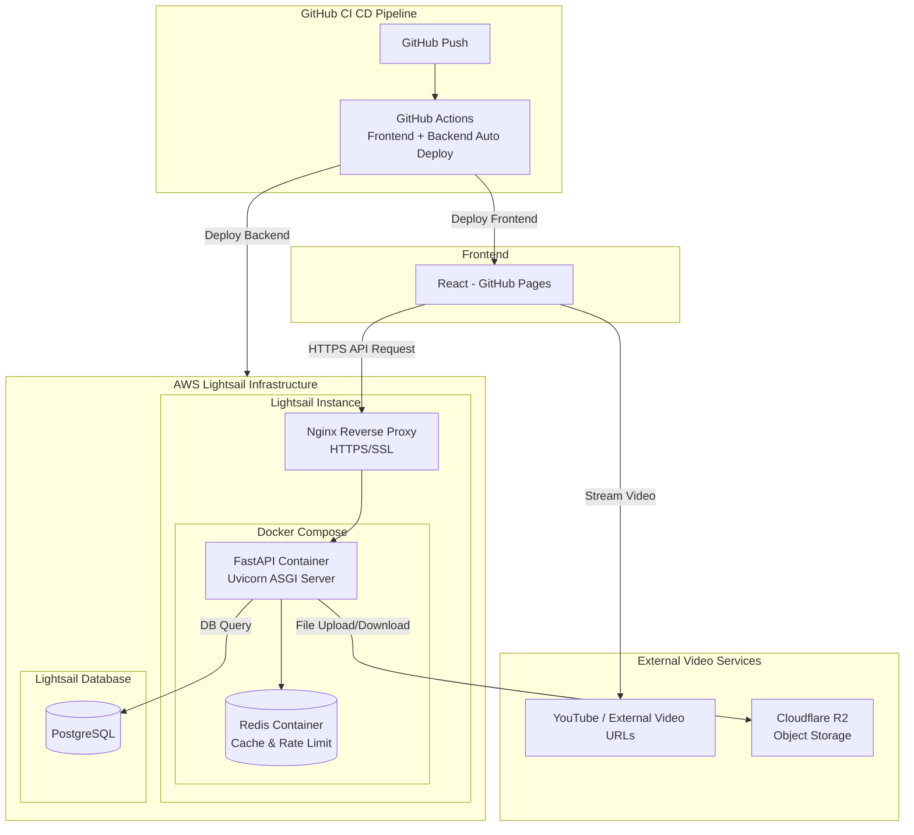
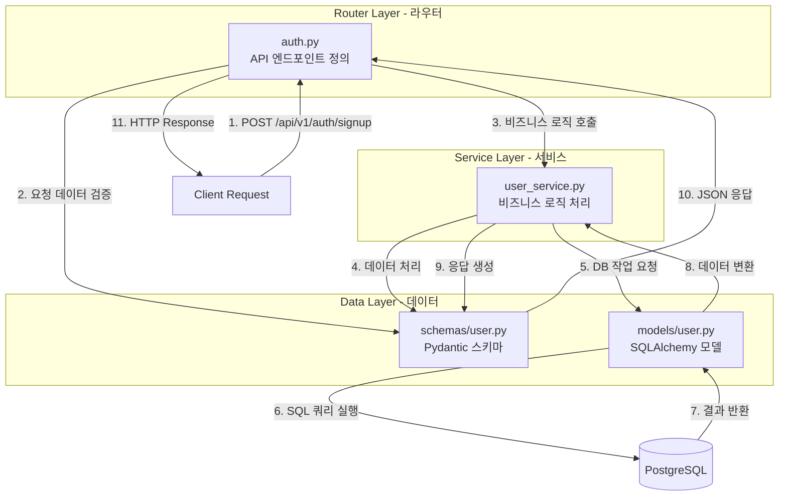

# BootRun (부트런)

> i5 Team Project: 강사와 수강생이 함께 성장하는 학습 플랫폼

## 팀원 소개

- 프론트엔드: 김규호(팀장), 김민주, 김채현
- 백엔드: 신가람, 장민경

## 1. 프로젝트 링크

- **Live Demo (GitHub Pages):** [`https://i5-team.github.io/bootrun-frontend/`](https://i5-team.github.io/bootrun-frontend/)
- **Back-End API (Swagger):** [`https://bootrun-backend.duckdns.org/docs`](https://bootrun-backend.duckdns.org/docs)
- **GitHub (Front-End):** [`https://github.com/i5-team/bootrun-frontend`](https://github.com/i5-team/bootrun-frontend)
- **GitHub (Back-End):** [`https://github.com/i5-team/bootrun-backend`](https://github.com/i5-team/bootrun-backend)
- **관리자 계정(테스트):**
  - ID: admin@bootrun.com
  - PW: adminSecureI5!
- **수강자 계정(테스트):**
  - ID: test@bootrun.com
  - PW: Test1234!@

## 2. 프로젝트 컨셉 (Why We Built It)

> "강사와 수강생이 함께 성장하는 실무 중심의 학습 플랫폼"

저희 i5팀은 인프런, 클래스101과 같은 기존 이러닝 플랫폼을 벤치마킹하되, 일방적인 영상 시청을 넘어 **체계적인 학습 관리(LMS)**와 **강사-수강생 간의 소통**이 가능한 전문 플랫폼을 구축하고자 했습니다.

특히 **구체적인 실무 역량**을 기를 수 있는 강의에 초점을 맞춘, 강사와 수강생이 **서로 공존할 수 있는 공간**을 만드는 것이 목표였습니다.


## 3. 시스템 아키텍처

### 3-1. 전체 아키텍처 다이어그램



### 3-2. 백엔드 아키텍처 다이어그램

**설계:** Router-Service 계층 분리, 비동기 처리, 의존성 주입



**핵심 특징:**
- **비동기 처리**: AsyncIO + AsyncPG로 고성능 비동기 데이터베이스 연결 풀링
- **계층 분리**: Router-Service 계층 분리로 비즈니스 로직과 API 분리
- **의존성 주입**: FastAPI Depends를 활용한 의존성 주입 및 권한 검증
- **쿼리 최적화**: SubQuery 최적화로 N+1 쿼리 문제 해결

**계층별 역할:**
- **Router (라우터)**: HTTP 요청을 받아 적절한 서비스로 라우팅하는 진입점. 요청 검증(Pydantic Schemas)과 응답 포맷 담당
- **Service (서비스)**: 비즈니스 로직과 데이터 처리 로직이 집중된 계층. 데이터베이스 쿼리, 캐시 조회, 외부 API 호출 등을 조율하며 재사용 가능한 로직 제공
- **Model (모델)**: SQLAlchemy ORM 모델로 데이터베이스 테이블 정의
- **Schema (스키마)**: Pydantic으로 요청/응답 데이터 검증 및 직렬화
- **Core (핵심 인프라)**: 데이터베이스 연결, JWT 인증, 캐시 관리 등 공통 기능 제공

## 4. 기술 스택

### 4-1. Back-End

| 구분      | 기술                                                                         | 핵심 사유                                                                                                                                    |
| --------- | ---------------------------------------------------------------------------- | -------------------------------------------------------------------------------------------------------------------------------------------- |
| **Core**  | `Python **3.x**`, `FastAPI **0.121**`, `Pydantic **2.12**`, `Loguru **0.7**` | **Python 기반 고성능 비동기** 웹 서버 구축. **Pydantic**으로 데이터 타입 안전성 및 자동 문서화 확보. **Loguru**로 구조화된 로깅 시스템 구현 (민감정보 자동 마스킹, Request ID 추적). |
| **DB**    | `PostgreSQL`, `SQLAlchemy 2.0`, `Alembic 1.17`, `asyncpg 0.30`               | **ACID 트랜잭션** 및 JSON 지원 DB 사용. ORM을 통한 타입 안전성 및 **고성능 비동기** 연결 풀링(pool_pre_ping, pool_recycle)으로 효율적인 데이터 접근. SubQuery 최적화 및 Eager Loading으로 N+1 쿼리 문제 해결.                 |
| **Auth**  | `JWT (Python-Jose 3.5)`, `Bcrypt 5.0`, `Cryptography 46.0`                   | **Access/Refresh Token 분리** 및 토큰 타입/발급자(iss) 검증. Bcrypt로 안전한 **비밀번호 암호화** 및 Fernet으로 민감 데이터 보호. Redis 기반 **브루트포스 방어** (5회 시도 제한 / 15분).                                     |
| **Cache** | `Redis 7.0`                                                                  | **인메모리 캐싱**을 통한 API 응답 속도 향상. 이메일 인증 코드(TTL 30분), 로그인 시도 제한, 비밀번호 재설정 토큰 관리. @cached 데코레이터 및 패턴 기반 캐시 무효화.                                                                             |

### 4-2. Infra & CI/CD

| 구분                 | 기술                                                                         | 핵심 사유                                                                                                                                                              |
| -------------------- | ---------------------------------------------------------------------------- | ---------------------------------------------------------------------------------------------------------------------------------------------------------------------- |
| **Deploy(Back-End)** | `AWS Lightsail (Compute, Database)`, `Cloudflare R2`, `Uvicorn **0.38**`, `Docker`, `Nginx` | **Docker + Docker Compose**로 일관된 컨테이너 환경 구축. **AWS Lightsail**에서 서버/DB 운영. **Cloudflare R2**로 파일 저장. **Nginx** 리버스 프록시 및 **Let's Encrypt SSL**(DuckDNS). `Uvicorn`으로 **고성능 비동기** 서버 환경 구축. **Graceful Degradation** (Redis 장애 시에도 서비스 유지). |
| **CI/CD**            | `GitHub Actions`                                                             | `dev` 브랜치 `push` 시, 자동으로 테스트, 빌드 및 프론트엔드(GitHub Pages) + 백엔드(Lightsail) 배포가 실행되도록 파이프라인 구축.                                                                         |


## 5. 폴더 구조

```
## backend 폴더구조
bootrun-backend/
├── app/
│   ├── main.py                 # FastAPI 앱 진입점, 라우터 등록, 미들웨어 설정
│   │
│   ├── core/                   # 핵심 설정 및 의존성
│   │   ├── config.py           # 환경 변수 및 설정 관리
│   │   ├── database.py         # PostgreSQL 연결 및 세션 관리
│   │   ├── redis.py            # Redis 캐시 초기화 및 관리
│   │   ├── security.py         # JWT 토큰 생성/검증, 비밀번호 해싱
│   │   ├── dependencies.py     # FastAPI 의존성 주입 
│   │   └── logging_config.py   # 구조화된 로깅 설정 
│   │
│   ├── models/                 # SQLAlchemy ORM 모델
│   │   ├── base.py             # 기본 모델 클래스
│   │   ├── user.py             # 사용자 모델
│   │   ├── course.py           # 강의, 챕터, 강의 영상 모델
│   │   ├── payment.py          # 결제 정보 모델
│   │   └── progress.py         # 수강 등록 및 학습 진행률 모델
│   │
│   ├── schemas/                # Pydantic 요청/응답 스키마
│   │   ├── user.py             # 사용자 스키마
│   │   ├── course.py           # 강의 스키마
│   │   ├── enrollment.py       # 수강 등록 스키마
│   │   ├── payment.py          # 결제 스키마
│   │   ├── admin.py            # 관리자 대시보드 응답 스키마
│   │   └── common.py           # 공통 응답 스키마 
│   │
│   ├── routers/                # API 엔드포인트
│   │   ├── auth.py             # 인증 API
│   │   ├── user.py             # 사용자 API
│   │   ├── course.py           # 강의 조회 API
│   │   ├── enrollment.py       # 수강 등록 API
│   │   ├── payment.py          # 결제 API
│   │   ├── storage.py          # Cloudflare R2 파일 스토리지 API
│   │   └── admin/              # 관리자 API
│   │       ├── dashboard.py    # 대시보드 통계 API
│   │       ├── users.py        # 사용자 관리 API
│   │       ├── courses.py      # 강의 관리 API
│   │       └── payments.py     # 결제 관리 API
│   │
│   ├── services/               # 비즈니스 로직 계층
│   │   ├── user_service.py                 # 사용자 서비스
│   │   ├── course_service.py               # 강의 조회 서비스
│   │   ├── enrollment_service.py           # 수강 등록 서비스
│   │   ├── payment_service.py              # 결제 서비스
│   │   ├── r2_service.py                   # Cloudflare R2 스토리지 서비스
│   │   ├── admin_dashboard_service.py      # 관리자 대시보드 서비스
│   │   ├── admin_user_service.py           # 관리자 사용자 관리 서비스
│   │   └── admin_course_service.py         # 관리자 강의 관리 서비스
│   │
│   ├── middleware/             # 미들웨어
│   │   └── rate_limit.py       # API 요청 속도 제한
│   │
│   ├── exceptions/             # 커스텀 예외 처리
│   │   ├── base.py             # 계층화된 예외 클래스
│   │   ├── handlers.py         # 전역 예외 핸들러
│   │   └── responses.py        # 표준화된 에러 응답
│   │
│   └── utils/                  # 유틸리티 함수
│       ├── cache.py            # Redis 캐싱 (@cached 데코레이터, 패턴 기반 무효화)
│       ├── constants.py        # 상수 정의 (캐시 TTL, 에러 메시지 등)
│       ├── email_service.py    # 이메일 발송 (인증 코드)
│       ├── helpers.py          # 헬퍼 함수 (시간대 변환, 페이지네이션 등)
│       └── video_duration.py   # 영상 길이 파싱
│
├── alembic/                    # 데이터베이스 마이그레이션
│   ├── versions/               # 마이그레이션 버전 파일
│   └── env.py                  # Alembic 환경 설정
│
├── scripts/                    # 운영 스크립트 (관리자 계정 생성, 테스트 계정 생성, 진행률 재계산 등)
│
├── docs/                       # 프로젝트 문서 (API 명명 규칙, 코딩 컨벤션, 기능 명세서, 리팩토링 가이드 등)
│
├── logs/                       # 로그 파일
│   ├── app.log                 # 애플리케이션 로그
│   └── error.log               # 에러 전용 로그
│
├── docker-compose.yml          # Docker Compose 설정
├── Dockerfile                  # Docker 이미지 빌드 설정
├── .dockerignore               # Docker 빌드 시 제외 파일
├── requirements.txt            # Python 패키지 의존성
├── alembic.ini                # Alembic 설정 파일
├── .env                       # 환경 변수 
├── .env.example               # 환경 변수 예제
├── .gitignore                 # Git 제외 파일 목록
├── deploy-ec2.sh              # EC2 배포 스크립트
├── update-deployment.sh       # 배포 업데이트 스크립트
└── README.md                  # 프로젝트 README
```


## 5. 데이터베이스 설계

**총 8개 테이블**

```
Users (사용자)
├─ Enrollments (수강 등록)
├─ Progresses (학습 진행률)
└─ Payments (결제)
   └─ Refunds (환불)

Courses (강의)
└─ Chapters (챕터)
   └─ Lectures (강의 영상)
```

## 6. ERD 다이어그램


## 7. 주요 기능

#### 강의실
**기능:** 영상 이어보기, 진행률 자동 저장, 강의 완료 처리, 커리큘럼 트래킹

- **성능 최적화**: `unique_watched_seconds`로 되감기 시에도 진행률 유지, 95% 이상 자동 완료 처리
- **API 아키텍처**: 비동기 진행률 업데이트, Service Layer에서 강의 전체 진행률 자동 계산
- **데이터 관리**: Redis 캐싱으로 강의 데이터 빠른 조회

#### 강의
**기능:** 강의 목록(필터링), 강의 상세, 수강 신청

- **성능 최적화**: SubQuery로 수강 인원, 완강률 한 번에 조회 (N+1 문제 해결)
- **API 아키텍처**: Eager Loading (selectinload, joinedload)으로 챕터/강의 영상 효율적 조회
- **데이터 관리**: Redis 캐싱으로 강의 목록 응답 속도 향상

#### 인증
**기능:** 회원가입(이메일 인증), 로그인(JWT)

- **인증 및 보안**: JWT Access/Refresh Token 분리, 토큰 타입/발급자(iss) 검증
- **보안**: bcrypt 비밀번호 암호화, Redis 기반 브루트포스 방어 (5회 시도 제한)
- **데이터 관리**: Redis 기반 이메일 인증 코드 관리 (TTL 30분)

#### 마이페이지
**기능:** 내 강의 목록, 프로필 수정(이미지 업로드/삭제), 계정 관리(비밀번호 변경/탈퇴)

- **배포 환경**: Cloudflare R2로 프로필 이미지 저장 및 관리
- **인증 및 보안**: 리소스 소유권 검증 (본인만 수정 가능)
- **데이터 관리**: Redis 캐싱으로 내 강의 목록 빠른 조회

#### 관리자
**기능:** 대시보드, 강의/사용자/결제 내역 관리

- **인증 및 보안**: 역할 기반 권한 검증 (ADMIN만 접근)
- **성능 최적화**: SubQuery + Eager Loading으로 대시보드 통계 빠른 조회
- **로깅 시스템**: Request ID 기반 관리자 행동 추적


#### 배포
**환경:** Docker 컨테이너화, AWS Lightsail, Cloudflare R2, HTTPS

- **컨테이너화**: Docker + Docker Compose로 일관된 배포 환경
- **서버**: AWS Lightsail (Compute, Database)
- **파일 저장소**: Cloudflare R2로 프로필 이미지, 강의 썸네일 저장
- **HTTPS**: Let's Encrypt SSL 인증서, DuckDNS 동적 DNS
- **프록시**: Nginx 리버스 프록시
- **안정성**: Graceful Degradation (Redis 장애 시에도 서비스 유지)

#### 로깅 및 모니터링
**시스템:** 구조화된 로깅, 민감정보 마스킹, Request ID 추적

- **민감정보 보호**: 비밀번호, JWT, API 키, 카드번호 자동 감지 및 마스킹
- **요청 추적**: Request ID 기반 요청 추적 (분산 환경 지원)
- **로그 관리**: 크기/날짜 기반 로테이션 파일 로깅
- **예외 처리**: 계층화된 예외 처리 (클래스명 → 에러 코드 자동 변환)


## 5. 실행 방법 (Getting Started)

**사전 요구 사항:** `Docker`, `Docker Compose`

```
# 1. SSH로 Lightsail 서버 접속
ssh -i ~/.ssh/lightsail-key.pem ubuntu@YOUR_IP

# 2. 저장소 클론
git clone https://github.com/I5-Team/bootrun-backend.git
cd bootrun-backend

# 3. 환경 변수 설정
cp .env.example .env
nano .env 

# 4. Docker Compose 실행
docker-compose up -d --build

# 5. 확인
docker-compose ps
```

## 6. 협업 규칙 (Collaboration Rules)

### 6-1. Git 브랜치 전략 (Git-flow)

- **`main`**: 최종 배포 버전
- **`dev`**: 개발 서버 (CI/CD 자동 배포)
- **`feat/{작업이름}`**: 기능 개발 (e.g., `feat/lecture-room`)
- **규칙:** `main`과 `dev` 브랜치에는 절대 직접 `push`하지 않습니다. 모든 작업은 `feat` 브랜치에서 진행 후, `dev`로 **Pull Request(PR)**를 생성하여 코드 리뷰를 거칩니다.

### 6-2. 커밋 메시지 (Commit Message)

| Gitmoji | **커밋 type** | 설명                                               |
| ------- | ------------- | -------------------------------------------------- |
| ✨      | feat          | 새 기능 추가                                       |
| 🗃️      | db            | DB: DB 스키마, 마이그레이션, 쿼리 변경             |
| 🔐      | auth          | Auth 관련: 인증/인가 로직 추가 및 수정             |
| 🌐      | api           | API 관련: API 엔드포인트 추가/변경                 |
| 🎨      | style         | UI 수정 (CSS/스타일/레이아웃)                      |
| ✅      | test          | 테스트 관련                                        |
| ♿️      | a11y          | 접근성 개선                                        |
| 🐛      | fix           | 기능/버그 수정                                     |
| **🔨**  | server        | Server 관련: 서버 설정, 미들웨어, 인프라 코드 변경 |
| ⚡️     | perf          | 성능 개선 (최적화, SEO 등)                         |
| ♻️      | refactor      | 코드 리팩토링 (기능 변경 X)                        |
| 📦      | chore         | 빌드 시스템, 환경설정 관련                         |
| 🔥      | remove        | 불필요한 코드/파일 삭제                            |
| 🍱      | asset         | 리소스 파일 관리                                   |
| 🚀      | deploy        | 배포 관련                                          |
| 📝      | docs          | 코드 외 문서 관련 / 오타 수정                      |

### 6-3. 그라운드 룰 (Ground Rules)

1. **회의:** 오전 10시 30분, 오후 3시 30분 (ZEP C3 열정 방)
2. 칭찬 감옥(월, 수, 금 오후 회의 이후)
3. 팀장에게 너무 의존하지 말기
4. 회의 시간 준수
5. 적극적 소통하기
6. **git 브랜치 전략 준수**
   1. **Git 브랜치 전략 : main(배포용) / develop(테스트용) / feature(기능단위 작업),**
   2. **PR(Pull Request)은 최소 1명 이상의 리뷰**를 받아야 Merge할 수 있습니다.
   3. `dev` 브랜치로 Merge 하기 전, 반드시 `dev`의 최신 변경사항을 `pull` 받아 로컬에서 테스트합니다.
7. 이슈 관리 : Git, GitHub Issue, Pull Request(PR) 작성 규칙에 따라 작업
8. 개발 규칙 : 코딩 컨벤션 통일
9. 답변은 가능하면 빠르게 하기

## 7. 핵심 트러블슈팅 (Troubleshooting)

프로젝트 진행 중 발생했던 주요 문제와 해결 과정입니다.

1. **[SQLAlchemy Enum 타입 매핑 오류]**
   - **문제**: `SQLEnum(Gender)` 사용 시, 데이터베이스에 Enum의 `name`이 저장되어야 하는데 `value`가 저장되거나, Alembic 마이그레이션 시 Enum 타입이 제대로 인식되지 않는 오류 발생.
   - **해결**: `values_callable=lambda obj: [e.value for e in obj]` 파라미터를 추가하여 Enum 객체의 실제 `value` 값을 명시적으로 데이터베이스에 저장하도록 설정. 이를 통해 Python Enum과 데이터베이스 간 데이터 타입 불일치 문제 해결.
2. **[강의 수강 완료 날짜 미기록 문제]** 
    - **문제**: `is_completed`가 `True`로 설정되어도 `completed_at` 필드가 `None`으로 남아있어, 완강 여부를 기반으로 한 다른 서비스 연동이 정상적으로 작동하지 않는 오류 발생.
    - **해결**: 시청률 95% 이상 도달 시 자동으로 `is_completed`를 `True`로 설정하는 동시에 `completed_at`에 현재 시간(`now`)을 기록하도록 로직 수정.
3. **[Certbot SSL 인증서 발급 문제 (통합)]** 
    - **문제**: `docker-compose.yml`의 certbot 서비스에 `entrypoint: "certbot renew"`가 설정되어 있어, `certbot certonly` 명령어를 입력해도 무시되고 항상 갱신만 시도하여 새 인증서가 발급되지 않음.
    - **해결**: certbot 서비스의 `entrypoint` 설정을 주석 처리하여 직접 입력하는 명령어가 실행되도록 수정. 인증서 발급 후 자동 갱신을 위해 다시 주석 해제.
    - **문제**: `certbot/conf/` 디렉토리에 이전 실패한 시도의 `accounts/`, `renewal/` 데이터가 남아있어, certbot이 "이미 등록된 도메인"으로 인식하고 갱신만 시도하여 새 인증서 발급이 불가능.
    - **해결**: `sudo rm -rf certbot/conf/* certbot/www/*`로 기존 certbot 데이터를 완전히 삭제한 후, 처음부터 새로 인증서 발급 시도하여 성공.
    - **문제**: Let's Encrypt가 DuckDNS의 CAA 레코드를 조회할 때 타임아웃 발생. DuckDNS DNS 서버의 응답 지연 또는 DNS 전파 지연으로 인증서 발급 실패.
    - **해결**: DuckDNS에서 IP 주소 재갱신 후 10-15분 대기하거나, certbot 데이터를 완전히 삭제하고 재시도하여 해결.
4. **[transaction_id(거래 ID)의 빈값 발생]**
   - **문제**: 결제 생성 성공 데이터에 `transaction_id`를 빈 문자열(” ”)로 반환됨. (결제 확인 조회 시 `transaction_id` 필요)
   - **해결**: UUID 모듈 추가, 결제 생성 시 응답에서 `transaction_id`를 반환하도록 수정
5. **[결제/환불 API 시간대(Timezone)]**
    - **문제**: `datetime` 필드가 UTC(0시간)로 형식 반환되어 실제 한국 시간보다 다르게 표시됨
    - **해결**: Pydantic `@field_serializer`로 모든 `datetime` 필드를 KST(UTC+9)로 변환

  

# 8. 팀원

- **김규호 (Front-End, 팀장):** 프로젝트 총괄, 인증(로그인/회원가입), 마이페이지 개발, CI/CD 구축 및 관리
- **김민주 (Front-End):** 강의 목록, 강의 상세 페이지, UI/UX 디자인 시스템, SEO 및 웹 접근성 구축, 사용자 결제 관리
- **김채현 (Front-End):** 강의실 페이지, 학습 관리(진행률) 기능, 관리자(대시보드, 강의관리, 결제관리, 사용자관리)
- **신가람 (Back-End):** DB 설계, 인증/사용자/강의/학습 진행/관리자(강의) API 개발, 서버 배포   
- **장민경 (Back-End):** 환경 설정(env/config), 결제/관리자(사용자·결제·대시보드) API 개발, 로컬 서버 구축  

# 9. 소감

- ## 김규호
  - 팀장으로서 프로젝트를 리딩하면서 새로운 관점에서의 업무를 수행해 보았고, 각 팀원들의 적극적인 태도와 협업이 있었기에 이러한 결과를 낼 수 있었다고 생각하고, 팀장의 기회를 주신 팀원들께 감사드립니다.
- ## 김민주
  - 팀 프로젝트를 진행하며 초기 개발 환경 세팅과 코드 컨벤션 등 협업 기준을 직접 설정하고 관리하며 팀원들과 소통하고, 협업 효율과 프로젝트 일관성을 유지하는 방법을 배울 수 있었습니다. 또한, 백엔드와 프론트엔드를 동시에 개발하며 정리되지 않은 데이터를 처리하고 가공하는 경험을 통해 데이터 구조를 이해하고 안정적인 기능을 구현하는 능력을 키울 수 있었습니다.
- ## 김채현
  - 이번 프로젝트를 통해 다양한 배경을 가진 팀원들과 함께 협업할 수 있었습니다.
    백엔드 지식이 깊은 분, 디자인 감각이 뛰어난 분, 실제 현업 경험이 있는 분들과 함께하며
    서로의 강점을 배우고 실제 서비스를 만들어가는 과정이 큰 성장 경험이 되었습니다.
- ## 신가람
  - 팀 프로젝트를 통해 협업 방식과 소통 방법, 그리고 함께 문제를 해결하는 과정을 깊이 경험할 수 있었습니다. 개발 환경 설정부터 아키텍처 설계, 그리고 프론트엔드와의 API 연동까지 진행하면서, 개발이 어떤 의미를 가지며 어떤 흐름으로 이루어지는지 많이 배울 수 있던 시간이었습니다.
- ## 장민경
  - 저희 팀은 꾸준히, 그리고 밀접하게 소통하였고 팀원 각자가 자신의 역할에 높은 책임감과 열정을 가지고 임한 덕분에 저도 어려운 문제들을 포기하지 않고 해결하며 프로젝트를 성공적으로 완수할 수 있었습니다.
